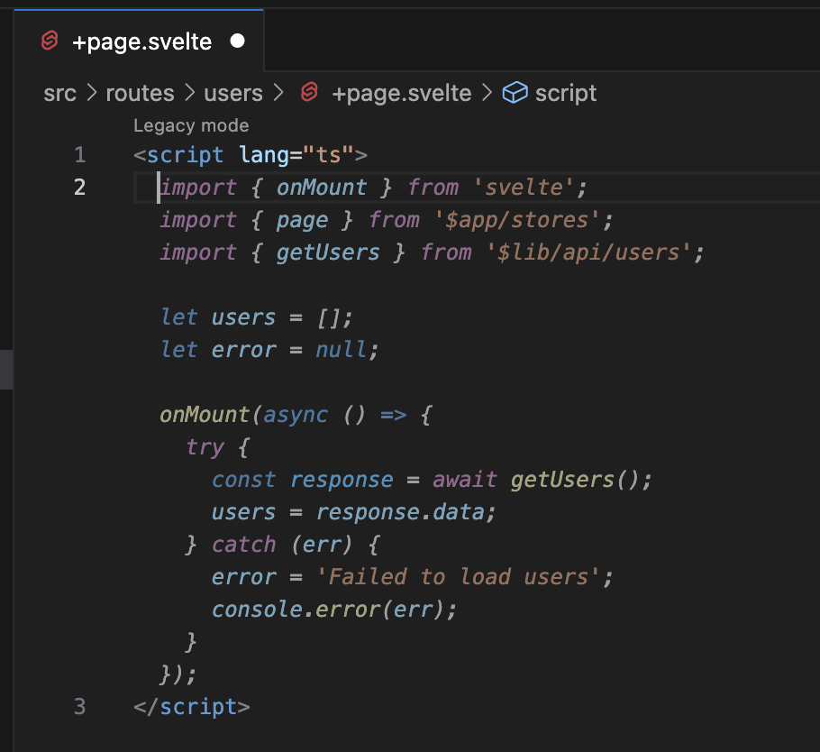
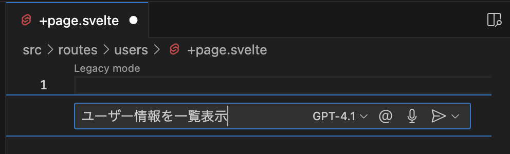
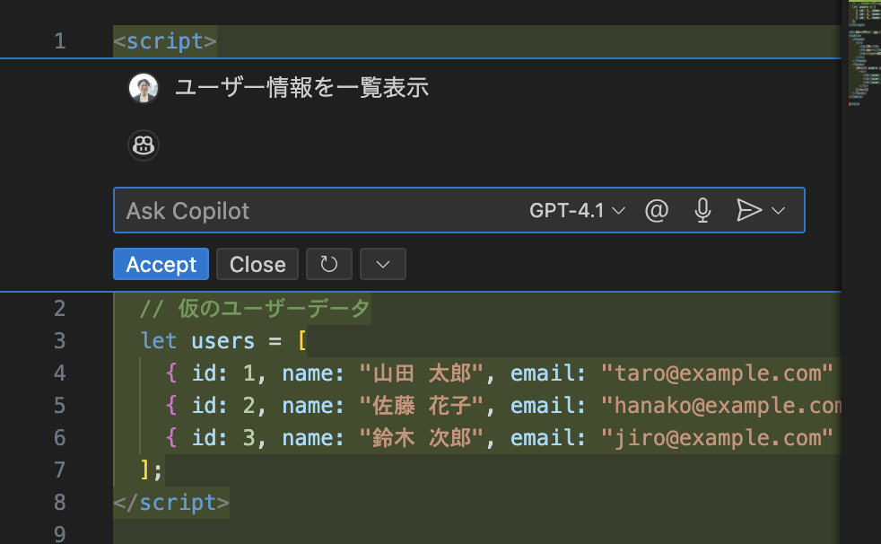
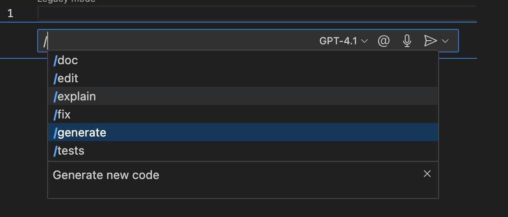
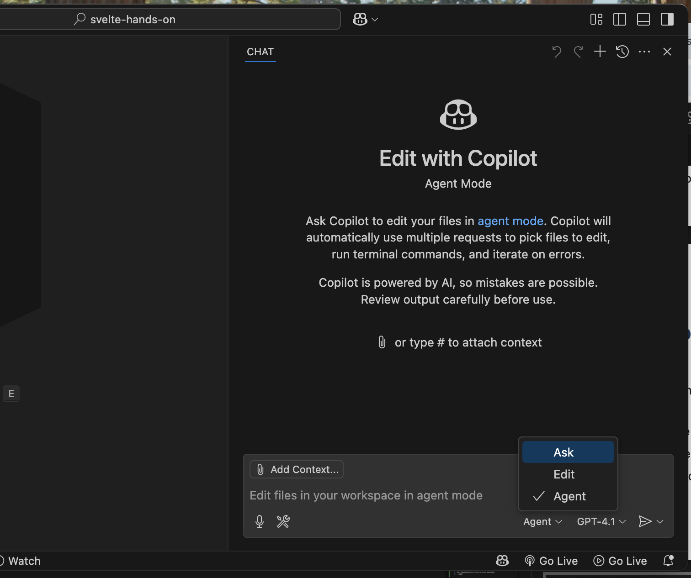
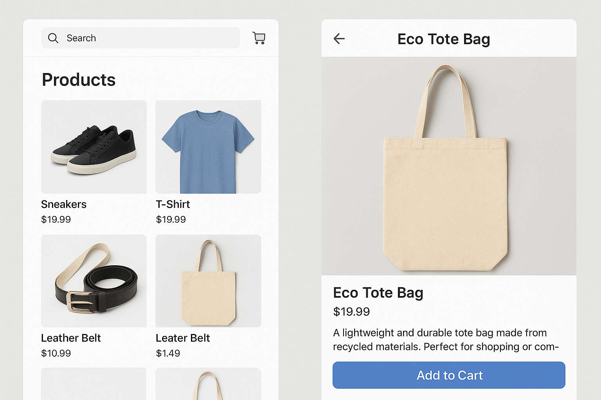
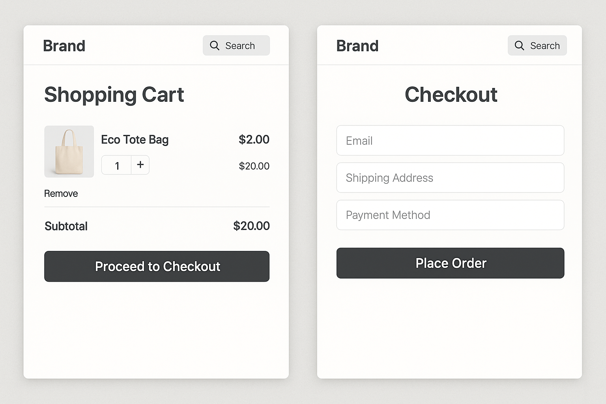
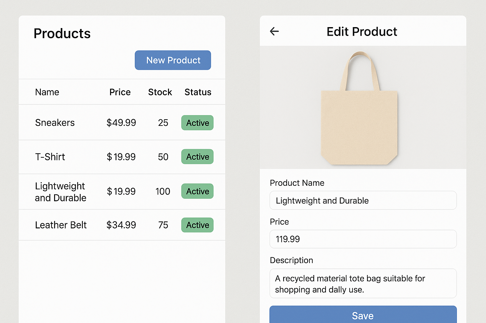

# Workshop
# Svelte + GitHub Copilot Hands On 

<style scoped>
section {
  display: flex;
  flex-direction: column;
  align-items: center;
  justify-content: center;
}
</style>

---
# Agenda

- 発表者紹介
- Svelte概説
- SvelteKit概説
- 当Workshopで使用する生成AI
- Hands On
- まとめ
- Q & A

---
# 発表者紹介

- [発表者](presenter.html)

---
# Svelte概説

- **Frontendフレームワーク**
  - HTML、CSS、JavaScript(TypeScript)でFrontend Webアプリを開発するためのフレームワーク
- **コンパイル型フレームワーク**
  - ビルド時に最小限のVanilla JSにコンパイルされ、実行時にはフレームワークのJSがほぼ不要
- **軽量で高速**
  - 仮想DOMを使わず、ネイティブなDOM操作を生成
- **学習コストが低い**
  - HTML, CSS, JavaScriptに近い構文
  - Webアプリ開発に必要な機能をフレームワークが標準サポート

---
# 他のフレームワークとの比較

<style>
table {
  font-size: 0.55em;
}

div {
  font-size: 0.4em;
  text-align: right;
}
</style>

| 特徴             | Svelte                         | React                           | Vue                         | Angular                      |
| ---------------- | ------------------------------ | ------------------------------- | --------------------------- | ---------------------------- |
| 初回リリース     | 2016                           | 2013                            | 2014                        | 2009 (1.x) 2016 (2.x)        |
| 種類             | コンパイラ                     | ライブラリ（UI）                | フレームワーク              | フルスタック・フレームワーク |
| 仮想DOM          | ❌ 使わない                     | ✅ 使用                          | ✅ 使用                      | ✅ 使用                       |
| ランタイム       | 必要なし（事前コンパイル）     | 必要（実行時に処理）            | 必要（軽量）                | 必要（重い）                 |
| 学習コスト       | 低い                           | 中程度                          | 低〜中                      | 高い                         |
| 開発規模         | 小〜中規模向き                 | 小〜大規模                      | 小〜中規模                  | 大規模向き                   |
| パフォーマンス   | 非常に高い（ランタイムなし）   | 高い（ただし仮想DOMコストあり） | 高い                        | 中〜高（複雑な構成が影響）   |
| TypeScript対応   | 良好（型サポート強化中）       | 非常に良好（公式に対応）        | 良好（Vue 3で改善）         | 標準で完全対応               |
| コミュニティ規模 | 小さめ                         | 非常に大きい                    | 大きい                      | 大きい                       |
| メンテナンス元   | OSS（Rich Harris, Vercel支援） | Meta (旧Facebook)               | Evan You 他 OSSコミュニティ | Google                       |

<div>
Chat GPT(GPT 4o)の回答
</div>

---
# 基本構成

Svelteでは、アプリケーションは1つ以上の **コンポーネント** で構成される。
**コンポーネント** : HTML、CSS、JavaScript (TypeScript) をカプセル化した再利用可能な自己完結型のコードブロックで、.svelte ファイルに記述
**.svelteファイルの書き方**

```html
<script>
  // JavaScript / TypeScript
</script>

<!-- HTML + Svelte構文 -->

<style>
  /* CSS / CSS拡張言語 */
</style>
```

---
# .svelteファイルの例

```html
<script>
  const message = 'World'; // 変数を定義
</script>

<p>Hello {message}</p> <!-- {}を使ってscript内の変数をHTML内に埋め込み-->

<style>
  p { color: green;} /* スタイルを定義 */
</style>
```

<style>
  p.ex { color: green;}
</style>

**表示すると**
<p class="ex">Hello World</p>

---
# Reactivity

Reactivity: 変数の変更を自動でUIに反映させる仕組み　(変数->UI)
`$state` rune(ルーン)を使用して実装

```html
<script lang="ts">
  let count = $state(0);  // countをReactiveな変数として宣言　初期値は0

  function increment() {
    count += 1;  // $stateで宣言された変数は、通常の変数と同様に扱える
  }
</script>

<button onclick={increment}>
  Clicked {count}   <!-- ボタンがクリックされるとcoutが1増える -->
  {count === 1 ? 'time' : 'times'}
</button>
```

Tutorial: Basic Svelte / Reactivity / [State](https://svelte.jp/tutorial/svelte/state)

---
# Bindings

Bindings: UIへの変更を自動で変数に反映させる仕組み　(UI->変数)
`bind:value` ディレクティブを使用して実装

```html
<script lang="ts">
  let name = $state('world');  // Reactiveな変数を宣言
</script>

<input bind:value={name} />  <!-- Reactiveな変数をテキストボックスにバインド -->

<h1>Hello {name}!</h1>  <!-- テキストボックスの入力値が表示される -->
```

Tutorial: Basic Svelte/ Bindings / [Text inputs](https://svelte.jp/tutorial/svelte/text-inputs)

チェックボックスやセレクトボックスも同様に`bind:value` ディレクティブを使用

---
# Props

Props: コンポーネントへデータを渡す仕組み　コンポーネントのプロパティ
`$props` runeを使用して実装

```html
<script lang="ts">
  import Nested from './Nested.svelte';
</script>

<Nested answer={42} />  <!-- コンポーネントにプロパティを設定 -->
```
Nested.svelte
```html
<script lang="ts">
  let { answer } = $props();  // プロパティの定義
</script>

<p>The answer is {answer}</p>  <!-- プロパティの使用 -->
```

---
# Props Type Safety

前頁の実装方法ではプロパティはany型になる。
プロパティに型を定義するには以下の様に実装する。

Nested.svelte
```html
<script lang="ts">
  interface Props {  // プロパティの型を定義
    answer: string;
  }

  let { answer } : Props = $props();  // 型を使用してプロパティを定義
</script>

<p>The answer is {answer}</p>
```

Tutorial: Basic Svelte / Props / [Declaring props](https://svelte.jp/tutorial/svelte/declaring-props)
Docs: Runes / \$props / [Type safety](https://svelte.jp/docs/svelte/$props#Type-safety)

---
# SvelteKit概説

- **SvelteKit**: 
  - Svelte公式のアプリケーションフレームワーク
  - Svelteをベースに、ルーティング・SSR(サーバーサイドレンダリング)・APIエンドポイント・データロード・静的サイト生成(SSG)などWebアプリ開発に必要な機能を統合
- **主な機能**
  - **ファイルベースルーティング**: `src/routes`ディレクトリ配下のファイル/ディレクトリ構成がそのままURLルーティングになる
  - **SPA/SSR/SSG対応**: サーバーサイドレンダリングや静的サイト生成が簡単に切り替え可能
  - **柔軟なデプロイ**: Vercel, Netlify, Cloudflareなど様々な環境にデプロイ可能

---
# プロジェクト構成

SvelteKitで作成したプロジェクトでは、コンポーネントやユーティリティの実装において以下を主に使用

```
📁 project
├── 📁 src
│   ├── 📁 routes <- URLでアクセスするコンポーネントを格納
│   │   └── 📁 xxx
│   │       ├── 📄 +page.svelte <- http://{domain}/xxxにアクセスしたら
│   │       │                      表示されるページ
│   │       └── 📄 +page.ts <- +page.svelteの事前処理
│   └── 📁 lib <- 他のコンポーネントが使用するコンポーネント、ユーティリティ等を格納
│       └── 📁 xxx
│           └── 📄 *.svelte, *.ts <- 他のコンポーネントから
│                                    import '$lib/xxx/*'; で使用
└── 📄 package.json
```

Docs: [プロジェクト構成](https://svelte.jp/docs/kit/project-structure)

---
# LoadingData - PageLoad

PageLoad: ページにアクセスした際にデータロード等の初期処理を実装する仕組み
`+page.ts`ファイルに`load`関数で実装

src/routes/users/[userId]/+page.ts
```ts
import type { PageLoad } from './$types';

// ページにアクセスした際にこの関数が呼び出される
export const load: PageLoad = ({ fetch, params }) => {
  const res = await fetch(`http://backend/api/users/${params.userId}`)

  const user = await res.json();

  return {  // ページ側で使用するデータをreturn
    user
  };
};
```

---
# LoadingData - PageProps

PageProps: PageLoadでreturnしたデータを受け取る仕組み
`+page.svelte`で`PageProps`、`$props`を使って実装

src/routes/users/[userId]/+page.svelte
```html
<script lang="ts">
  import type { PageProps } from './$types';

  let { data }: PageProps = $props();
</script>

<h1>{data.user.name}</h1>
```

Docs: SvelteKit / Core Concepts / [Loading data](https://svelte.dev/docs/kit/load#Page-data)

---
# 生成AI

- 当ハンズオンで使用する生成AIツール
  - GitHub Copilot(以下 Copilot) + VSCode
- 主な使用方法
  - Code Assist
  - Editor Inline Chat
  - Chat (Ask, Edit, Agent)

---
# Code Completions

<div class="left-right">
  <div>
    <ul>
      <li>ファイルの編集中に編集内容をCopilotが提案</li>
      <li>提案内容は編集中のカーソル位置の先に表示</li>
      <li>提案内容は<code>Tab</code>で確定</li>
      <li>参考: <a href="https://code.visualstudio.com/docs/copilot/ai-powered-suggestions">Code Completions</a> </li>
    </ul>
  </div>
  <div>
    
  </div>
</div>

---
# Editor Inline Chat

<div class="left-right">
  <div>
    <ul>
      <li>ファイルの編集中に編集内容をCopilotに指示</li>
      <li>起動方法
        <ul>
          <li>Command Palette > <code>Inline Chat: Editor Inline Chat</code></li>
          <li>Win: <code>Ctrl</code> + <code>I</code></li>
          <li>Mac: <code>⌘</code> + <code>I</code></li>
        </ul>
      </li>
      <li>参考: <a href="https://code.visualstudio.com/docs/copilot/chat/inline-chat">Inline Chat</a></li>
    </ul>
  </div>
  <div>
    
    
  </div>
</div>

---
# Editor Inline Chat - Slash Command

<div class="left-right">
  <div>
    <ul>
      <li><code>/</code> + <code>{command}</code>で</li>
    </ul>
  </div>
  <div>
    
  </div>
</div>

---
# Chat

<div class="left-right">
  <div>
    <ul>
      <li>
        CopilotとChat(指示、質問等)するめのUI
      </li>
      <li>
        ウィンドウ上部やや右のCopilotアイコンを右クリック><code>Open Chat</code>で表示
      </li>
      <li>
        ウィンドウ右下でモード切替
        <ul>
        <li>
          <code>Ask</code>: ファイル編集無しの質疑応答
         </li>
         <li>
          <code>Edit</code>: 単一ファイルの編集
         </li>
         <li>
          <code>Agent</code>: 複数ファイルの編集
         </li>
        </ul>
      </li>
    </ul>
  </div>
  <div>
    
  </div>
</div>

<style>
  .left-right {
    display: flex; gap: 24px;
  }

  .left-right > div {
    flex: 1;
  }

  .left-right > div {
    font-size: 0.9rem;
    text-align: left;
  }
</style>

---
# Repository Custom Instructions

- 日本語訳: リポジトリ カスタム命令
- リポジトリ内でのCopilotへのプロンプトに共通で付加される情報
- Copilot向けのアーキテクチャ仕様書、実装ガイド
- 以下のファイルに自然言語で記載

`.github/copilot-instructions.md`

Document: [GitHub Copilot のリポジトリ カスタム命令を追加する](https://docs.github.com/ja/copilot/customizing-copilot/adding-repository-custom-instructions-for-github-copilot)

---
# Demo

1. <a href="#2-プロジェクト作成">プロジェクト作成</a>
2. Copilot (Agent)に生成を指示
   - プロンプト: URL /usersにユーザー情報の一覧表示を行うページの生成
3. instructionを作成

```sh
mkdir .github
echo "- モデルはinterfaceとして個別のファイルに定義する。" > .github/copilot-instructions.md
```

4. Copilotに再生成を指示

---
# Hands On

- **題目**: Svelte、SvelteKitでWebアプリを作る
- **時間**: 40min
- **Webアプリ概要**
  - ECサイト(後述)
  - Backendにはjson-serverを使用
- **目的**
  - Svelte、SvelteKitの構文・機能を覚える
  - Copilotの使い方・使い所を覚える
  - Webアプリを完成させる　でなはい

---
# 作成するページ

- 利用者向け
  - `/` :トップページ　商品が一覧表示される　キーワードで商品の検索ができる
  - `/products/{productId}/`: 商品の詳細ページ　商品の詳細が表示される
  - `/cart/`: ショッピングカートページ　ショッピングカート内の商品が表示される
  - `/checkout/`: 購入ページ　ショッピングカート内の商品の購入ができる
- 店舗向け
  - `/shop/products/`: 商品一覧ページ　商品が一覧表示される
  - `/shop/products/new`: 商品登録ページ　商品の登録が行える
  - `/shop/products/{productId}`: 商品更新ページ　商品の更新・削除が行える

---
# 作成するページイメージ　利用者向け



---
# 作成するページイメージ　利用者向け



---
# 作成するページイメージ　店舗向け



---
# 作業ステップ

1. 必要なソフトウェアのインストール
2. プロジェクト作成
3. json-serverのセットアップ
4. 初期断面のコミットと動作確認
5. 重点別ステップ
   - Svelteを重点的に覚える
   - Copilotを重点的に覚える

---
# 2. プロジェクト作成

コマンドプロンプト(Windows) / ターミナル(Mac)で以下のコマンドを実行

```sh
# このディレクトリ以下に後続のコマンドでプロジェクトを作成
cd 任意のディレクトリ 

# プロジェクト作成
pnpm dlx sv create --template minimal --types ts --no-add-ons --install pnpm svelte-hands-on

cd svelte-hands-on

# 依存ライブラリのインストール
pnpm dlx sv add eslint prettier --install pnpm

# Frontendサーバーの起動
pnpm dev
```

参考: [sv create](https://svelte.jp/docs/cli/sv-create)

---
# 3. json-serverのセットアップ

**[json-server](https://github.com/typicode/json-server):** jsonファイルに対しCRUD処理を行うREST APIを提供するサーバー

以下のコマンドを実行

<p class="code">
<span class="comment"># json-serverのインストール</span><br/>
pnpm add -D json-server<br/>
<br/>
<span class="comment"># ハンズオン用jsonファイル取得</span><br/>
curl -O https://raw.githubusercontent.com/project-au-lait/svelte-hands-on-sample-application/refs/heads/main/db.json<br/>
<br/>
<span class="comment"># json-serverの起動</span><br/>
pnpm json-server db.json
</p>

<style scoped>
  p.code {
    border: 1px solid var(--borderColor-default);
    background-color: var(--bgColor-muted);
    font-size: 0.8rem;
    padding: var(--base-size-16);
  }
  span.comment {
    color: var(--color-prettylights-syntax-comment);
  }
</style>

---
# 4. 初期断面のコミットと動作確認

以下のコマンドを実行

```sh
# Gitリポジトリの作成と初期断面のコミット
git init && git add -A && git commit -m "Initial commit" 

# プロジェクトをVScodeで開く
code .
```

ブラウザで以下のURLにアクセス

- Frontendサーバー: http://localhost:5173 -> "Welcome to SvelteKit"等が表示される
- json-server: http://localhost:3000 -> "JSON Server"等が表示される

---
# 5. 重点別ステップ　Svelteを重点的に覚える

1. <a href="#作成するページ">作成するページ</a>のページごとに以下のステップを繰り返し
   1. URLに対応するディレクトリに+page.svelte、+page.tsファイルを作成
   2. 作成したファイルの内容を実装
      - このとき、CopilotのCode AssistやEditor Inline Chatを適宜使用
   3. 実装したファイルの実行結果をブラウザで確認 


---
# 5. 重点別ステップ　Copilotを重点的に覚える

1. Copilot Chat (Agent Mode)に、ページの要件とソースコードの生成指示のプロンプトを送信
2. 生成されたソースコードの実行結果をブラウザで確認
3. 生成されたソースコードの内容を確認
4. 修正したい場合
   1. プロンプト、Instructionを修正 -> ステップ1.へ
      ※ 何度生成しても期待通りにならない場合は手で修正
5. 修正が不要な場合
   1. 次のページに対しステップ1.から実行

---
# 補足: より高度な機能

- **Store**
  - 複数のコンポーネント間で状態（データ）を共有・管理しリアクティブに値の変更を伝播するための仕組み
  - 参考: [Doc](https://svelte.dev/docs/svelte/stores) / [Tutorial](https://svelte.dev/tutorial/svelte/stores)
- **Layout**
  - ページ間で共通するUIやロジック（ヘッダー、フッター、ナビゲーションなど）をまとめて定義できる仕組み
  - `+layout.svelte`ファイルに記述し、配下のページで共通利用される
  - 参考: [Doc](https://svelte.dev/docs/kit/routing#layout)

---
# ハンズオン中の質問

質問したい場合はGoogle Meetのウィンドウ下部の✋️アイコンをクリックしてください。
運営スタッフ(有識者)がチャットで新しいGoogle MeetのURLを送るので、そのMeet内でスタッフに質問してください。

---
# Q & A

---
# まとめ Svelte

- 以下の機能を使えば基本的なWebアプリは実装可能
  - Reactivity、Bindings、Props、Data Loading、Store、Layout
- これらは標準機能のため設定不要で使用可能
- 他のフレームワークよりも軽量で高速なアプリとなる
- 周辺ライブラリや実装例は他のフレームワークに比べまだ少ない

---
# まとめ Copilot

- 得意
  - 生成の早さ　(プロンプトとインストラクションの品質次第)
- (まだ)苦手
  - ライブラリの導入や共通機能の実装等　(CSSフレームワークの導入、API呼び出し処理の共通化、、、)
  - 新しい技術等のネット上に情報が少ない分野　(Runes、Store、、、)
- 使うために必要なこと
  - 使う前の準備
  - 使い所の判断
  - 生成されたコードの妥当性の判断

---
# ご参加いただきありがとうございました